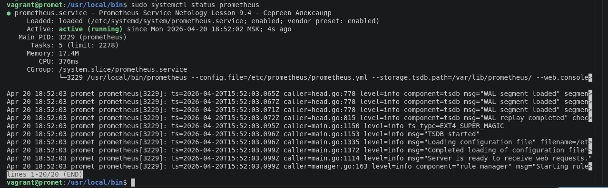
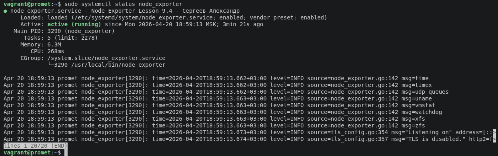
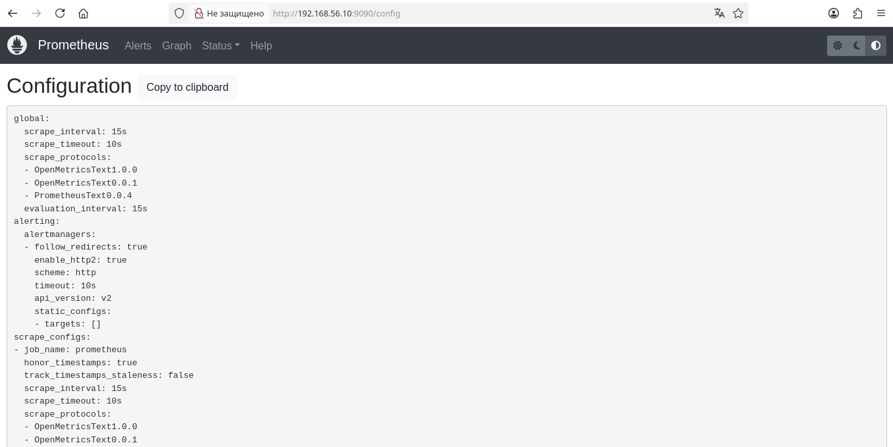
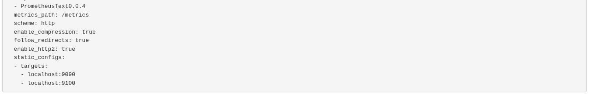
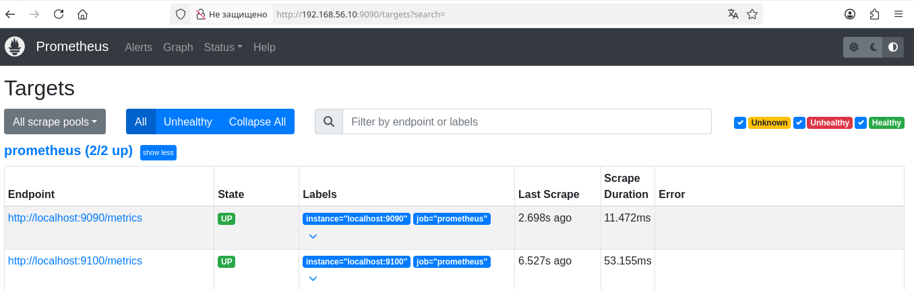
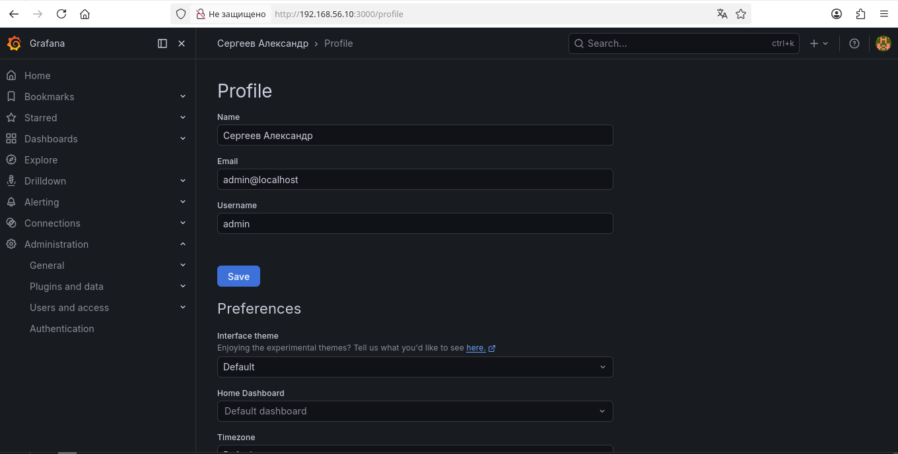
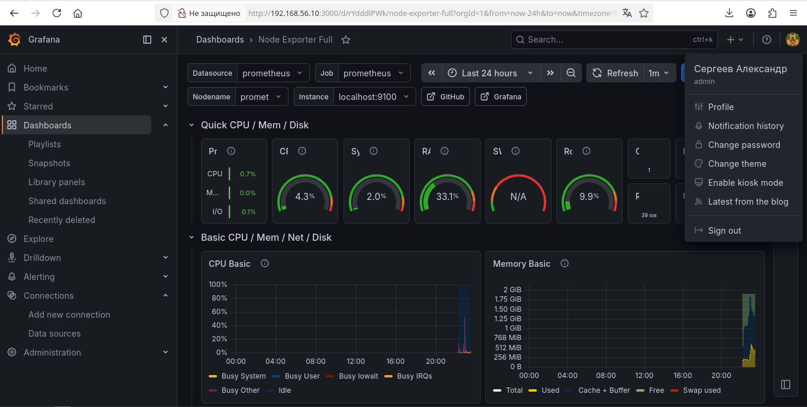

# Домашнее задание к занятию "Система мониторинга Prometheus" - Сергеев Александр

### Инструкция по выполнению домашнего задания

   1. Сделайте `fork` данного репозитория к себе в Github и переименуйте его по названию или номеру занятия, например, https://github.com/имя-вашего-репозитория/git-hw или  https://github.com/имя-вашего-репозитория/7-1-ansible-hw).
   2. Выполните клонирование данного репозитория к себе на ПК с помощью команды `git clone`.
   3. Выполните домашнее задание и заполните у себя локально этот файл README.md:
      - впишите вверху название занятия и вашу фамилию и имя
      - в каждом задании добавьте решение в требуемом виде (текст/код/скриншоты/ссылка)
      - для корректного добавления скриншотов воспользуйтесь [инструкцией "Как вставить скриншот в шаблон с решением](https://github.com/netology-code/sys-pattern-homework/blob/main/screen-instruction.md)
      - при оформлении используйте возможности языка разметки md (коротко об этом можно посмотреть в [инструкции  по MarkDown](https://github.com/netology-code/sys-pattern-homework/blob/main/md-instruction.md))
   4. После завершения работы над домашним заданием сделайте коммит (`git commit -m "comment"`) и отправьте его на Github (`git push origin`);
   5. Для проверки домашнего задания преподавателем в личном кабинете прикрепите и отправьте ссылку на решение в виде md-файла в вашем Github.
   6. Любые вопросы по выполнению заданий спрашивайте в чате учебной группы и/или в разделе “Вопросы по заданию” в личном кабинете.
   
Желаем успехов в выполнении домашнего задания!
   
### Дополнительные материалы, которые могут быть полезны для выполнения задания

1. [Руководство по оформлению Markdown файлов](https://gist.github.com/Jekins/2bf2d0638163f1294637#Code)

---

### Задание 1

Установил Prometheus.

1. Выполняя задание, сверялся с процессом, отражённым в записи лекции.
2. Создал пользователя prometheus.
3. Скачал prometheus и в соответствии с лекцией разместил файлы в целевые директории.
4. Создал сервис prometheus.service как показано на уроке.
5. Проверил, что prometheus запускается, останавливается, перезапускается и отображает статус с помощью systemctl.

Прикрепил к файлу README.md скриншот systemctl status prometheus, где написано:
"prometheus.service - Prometheus Service Netology Lesson 9.4 - Сергеев Александр"

---

### Задание 2

Установил Node Exporter.

1. Выполняя ДЗ, сверялся с процессом, отражённым в записи лекции.
2. Скачал node exporter, приведённый в презентации, и в соответствии с лекцией разместил файлы в целевые директории.
3. Создал сервис node_exporter.service как показано на уроке.
4. Проверил, что node exporter запускается, останавливается, перезапускается и отображает статус с помощью systemctl.

Прикрепил к файлу README.md скриншот systemctl status node-exporter, где написано:
"node-exporter.service - Node Exporter Netology Lesson 9.4 - Сергеев Александр"

---

### Задание 3

Подключил Node Exporter к серверу Prometheus.

1. Выполняя ДЗ, сверялся с процессом отражённым в записи лекции.
2. Отредактировал prometheus.yaml, добавив в массив таргетов установленный в задании 2 node exporter.
3. Перезапустил prometheus.
4. Проверил что он запустился.

Прикрепил к файлу README.md скриншот конфигурации из интерфейса Prometheus вкладки Status > Configuration.

Прикрепил к файлу README.md скриншот из интерфейса Prometheus вкладки Status > Targets, где видно минимум два эндпоинта.

---

### Задание 4

Установил Grafana.

Прикрепил к файлу README.md скриншот интерфейса, где видны мои ФИО.

---

### Задание 5

Интегрировал Grafana и Prometheus.

Прикрепил к файлу README.md скриншот интерфейса с дашбоард grafana с данными одного хоста (promet).

